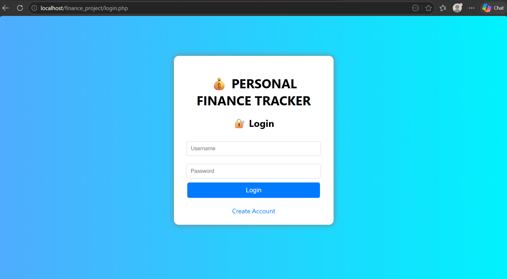
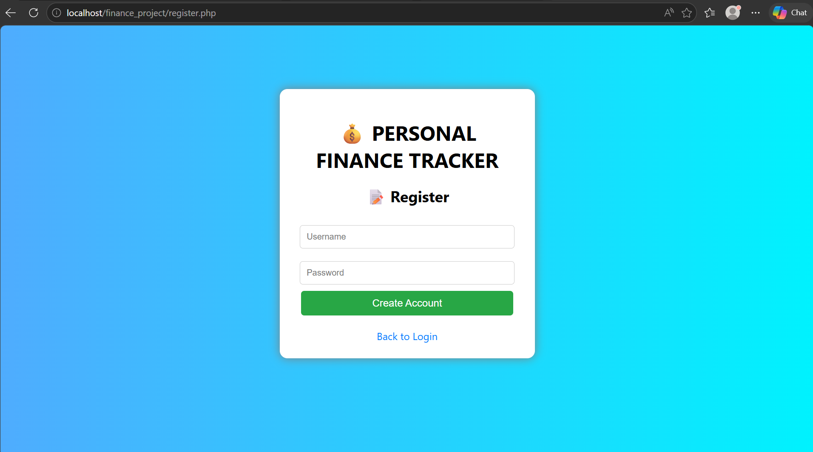
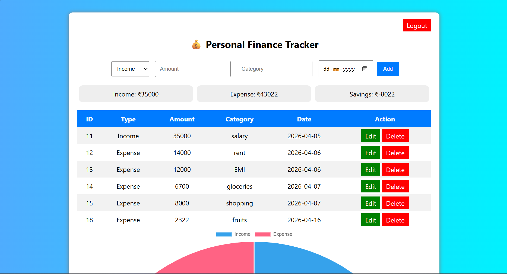

# 💰 Personal Finance Tracker

## 📌 Project Description
A simple web application to track income and expenses. Users can register, login, and manage their personal financial transactions.

## 🚀 Features
- User Registration & Login
- Add Income and Expenses
- View total Income, Expense, Savings
- User-specific data (each user sees only their data)
- Simple and clean UI

## 🛠 Technologies Used
- Frontend: HTML, CSS
- Backend: PHP
- Database: MySQL (phpMyAdmin)
- Server: XAMPP

## 📂 How to Run
1. Install XAMPP
2. Start Apache and MySQL
3. Copy project folder to `htdocs`
4. Open phpMyAdmin and import database
5. Run in browser: `http://localhost/finance_project`
6. To open phpmyadmin: 'http://localhost/phpmyadmin'
7. To register: 'http://localhost/finance_project/register.php'
8. To login: 'http://localhost/finance_project/login.php'

## 📸 Screenshots
### Login Page

### Register Page

### Dashboard

### How transcation deatails are stored in phpmyadmin
### How user deatails are stored in phpmyadmin
### Graphical design in dashboard

## 👨‍💻 Author
SAKSHI CN
